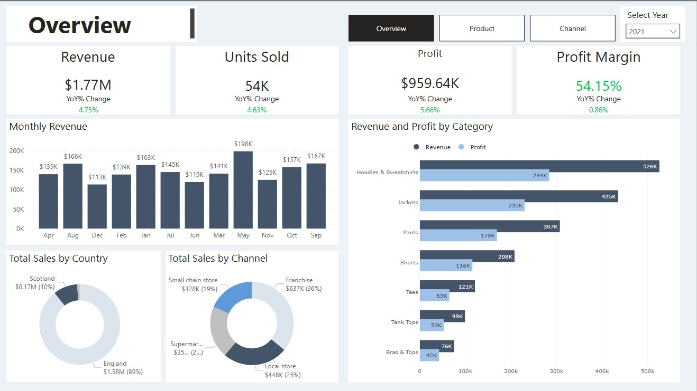
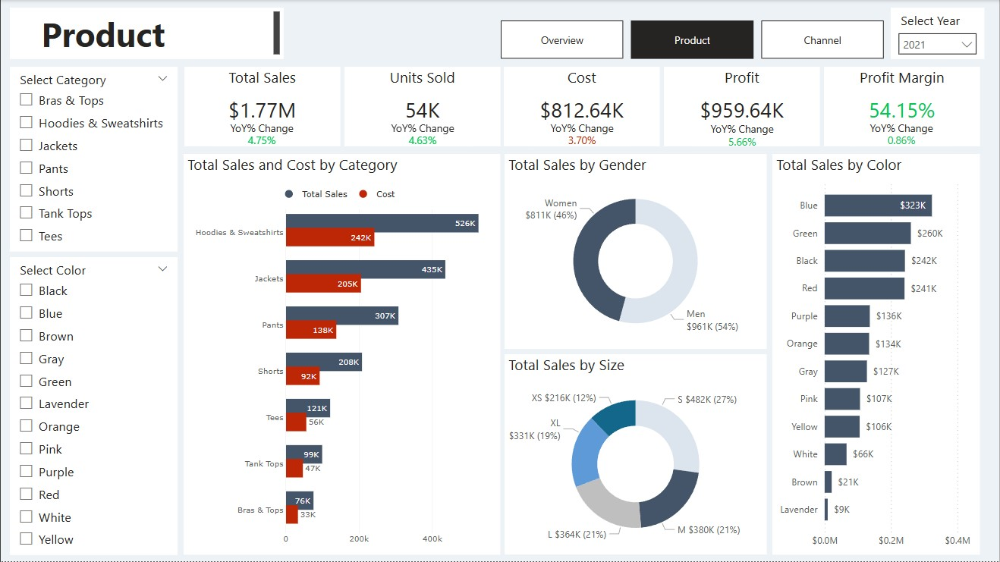

# 📊 Threads Ltd - Sales Report

## 📌 Table of Contents
1. [Introduction](#introduction)
2. [Dataset Overview](#dataset-overview)
3. [Data Preparation](#data-preparation)
   - [Loading and Cleaning Data](#loading-and-cleaning-data)
   - [Creating a Dimension Date Table](#creating-a-dimension-date-table)
   - [Data Model Relationships](#data-model-relationships)
4. [Report and Visualization](#report-and-visualization)
   - [Overview Page](#overview-page)
   - [Product Page](#product-page)
   - [Channel Page](#channel-page)
5. [Key Findings & Insights](#key-findings--insights)
6. [How to Use This Project](#how-to-use-this-project)
   - [Power BI Report](#power-bi-report)
   - [Using Cleaned Data](#using-cleaned-data)
7. [Future Work & Improvements](#future-work--improvements)
8. [References](#references)

## Introduction
This report focuses on analyzing the sales data of **Threads Ltd**, a company that operates through a network of retailers and chain stores across the country. The dataset for this report was sourced from **DataCamp** and includes the following tables:

- **Orders Table**: Contains sales data, including total sales and cost of goods sold (COGS).
- **Returns Table**: Lists returned products.
- **Products Table**: Contains details of each product type.
- **Retailers Table**: Provides information about the retailers who ordered the products.

## Dataset Overview
The dataset provides valuable insights into sales performance, profitability, and trends. By leveraging Power BI, this report aims to highlight key patterns in sales, identify successful sales channels, and optimize business strategies.

## Data Preparation
### Loading and Cleaning Data
- Loaded the dataset into **Power BI Desktop**.
- Inspected and cleaned each table to remove duplicates and errors.
- Ensured no outliers were present in the dataset.
- Identified the **Orders Table** as the fact table.

### Creating a Dimension Date Table
- Created a **dimension date table** to utilize **time intelligence functions** in DAX.
- Ensured a continuous display of data, even when some days had no sales recorded in the fact table.

### Data Model Relationships
- Established relationships between tables to create a structured and connected data model.

## Report and Visualization
### Overview Page
- Displays **total revenue, total units sold, total profit, profit margin by year, and Year-over-Year (YoY) % Change**.
- Includes charts for:
  - **Total revenue by month**.
  - **Total revenue by country and sales channel**.
  - **Total revenue and profit by product category**.

- Sales data can be filtered by **year**.

### Product Page
- Provides details about the products sold by Threads Ltd.
- Displays **total sales, units sold, cost, profit, profit margin, and YoY % Change**.
- Allows filtering by **product category**.

### Channel Page
- Shows **sales performance by country and sales channel**.
- Includes a table showing **total sales by country, region, and city**, along with sales trends.
- Filters are available for **country, channel, and product category**.

## Key Findings & Insights
- Identified **top-selling products** and **highly profitable categories**.
- Analyzed the effectiveness of **different sales channels**.
- Evaluated the impact of **product returns on overall profitability**.

## How to Use This Project
### Power BI Report
1. Download the `threads_ltd_sales_report.pbix` file.
2. Open it using **Power BI Desktop**.
3. Interact with the dashboard to explore insights and trends.

### Using Cleaned Data
- The cleaned dataset (`factorders_clean.csv`, `dimreturns_clean.csv`, `dimretailers_clean.csv`, `dimproducts_clean.csv`, `dimdate_clean.csv`) can be imported into **Python, R, or SQL** for further analysis.

## Future Work & Improvements
- Expand the dataset with additional parameters, such as **customer data or market trends**.
- Implement **machine learning models** to predict **future sales trends**.
- Conduct **sentiment analysis** to evaluate **customer satisfaction**.

## References
- [DataCamp Dataset](https://www.datacamp.com)
